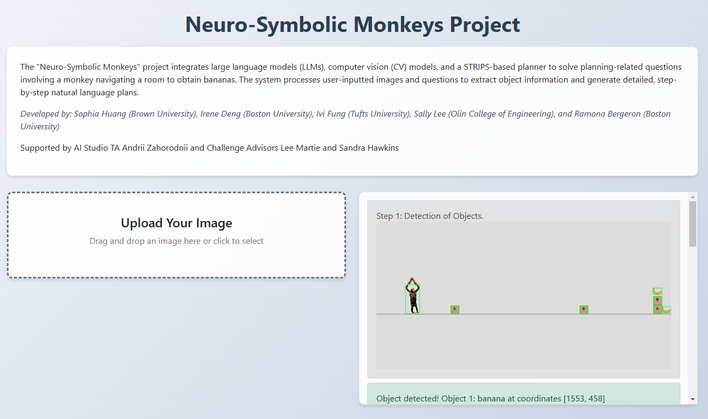
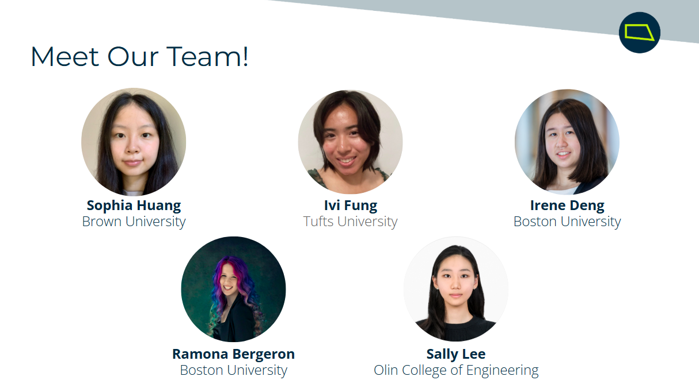
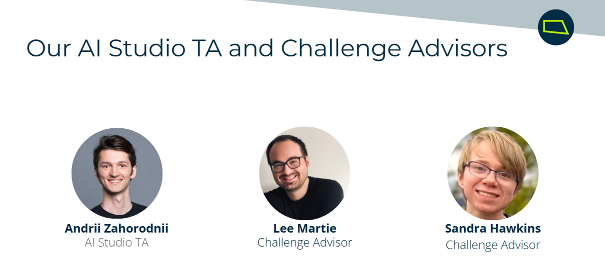

# Neuro-Symbolic Monkeys Project

A user-friendly web application that leverages a neuro-symbolic approach, combining Computer Vision (CV), Automated Planning (STRIPS), and Large Language Models (LLMs) to solve multimodal planning tasks. The system processes user-inputted images and questions to generate reliable, provably-correct plans for a monkey navigating rooms to obtain bananas. By integrating neural components (CV, LLMs) with symbolic reasoning (STRIPS planner), the project achieves both flexibility in understanding natural language/images and guaranteed correctness in the generated action sequences.



## Features
- **Computer Vision (CV):** Detect and classify objects in an input image (monkey, bananas, boxes).
- **STRIPS Planner:** Generate logical plans to achieve the goal based on detected objects and preconditions.
- **Large Language Models (LLMs):** Translate plans into natural language for easy interpretation.

## Developed By
- **Sophia Huang** (Brown University)
- **Irene Deng** (Boston University)
- **Ivi Fung** (Tufts University)
- **Sally Lee** (Olin College of Engineering)
- **Ramona Bergeron** (Boston University)


Supported by:
- **AI Studio TA:** Andrii Zahorodnii
- **Challenge Advisors:** Lee Martie, Sandra Hawkins


## Getting Started

### Prerequisites
Make sure you have Python installed (>=3.8) and the following libraries:
- Flask
- OpenAI
- PyTorch
- dotenv
- GPT4All
- OpenCV (cv2)
- Pillow
- torchvision
- joblib

Install all dependencies using:
```bash
pip install flask openai pytorch torchvision dotenv gpt4all opencv-python pillow joblib
```

### Setup
1. Clone the repository.

2. Add your OpenAI API key to a `.env` file:
```
OPENAI_API_KEY=your_api_key_here
```

3. Place the `screenshot.png` file in the root directory.

### Run the Application
Start the Flask web interface:
```bash
python web-interface.py
```

Open your browser and navigate to `http://127.0.0.1:5000` to use the interface.

## Project Structure
- `cv/`: Computer vision models and image processing
  - `cvmodel.py`: CNN model architecture and training
  - `split_roi.py`: ROI detection and object boundary analysis
- `llm/`: Large Language Model integration
  - `llm_openai.py`: OpenAI GPT-4 interface
  - `llm_gpt4all.py`: Local GPT4All interface
- `strips-planner/`: Planning system
  - `strips.py`: Core STRIPS implementation
- `templates/`: Static web assets
- `templates/`: Flask HTML templates
- `web_interface.py`: Main Flask application

## How It Works
1. **Input Image:** Upload an image depicting a monkey, bananas, and obstacles.
2. **CV Processing:** Extract bounding boxes and classify objects using OpenCV and a CNN.
3. **STRIPS Planner:** Generate logical steps based on the object's locations and the goal.
4. **LLM Integration:** Translate logical steps into natural language for easy understanding.

## Example Usage
1. Upload an image (e.g., a monkey and a banana scenario).
2. View the step-by-step solution in the UI.